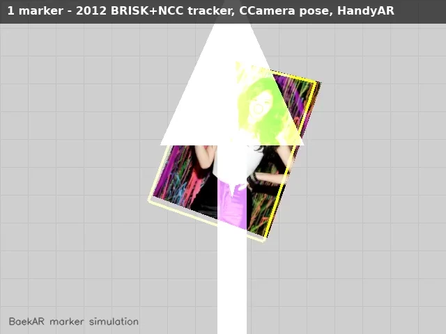
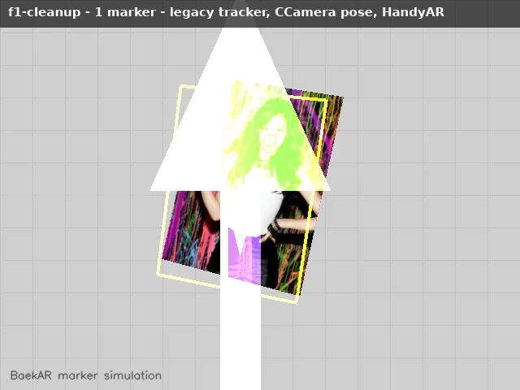
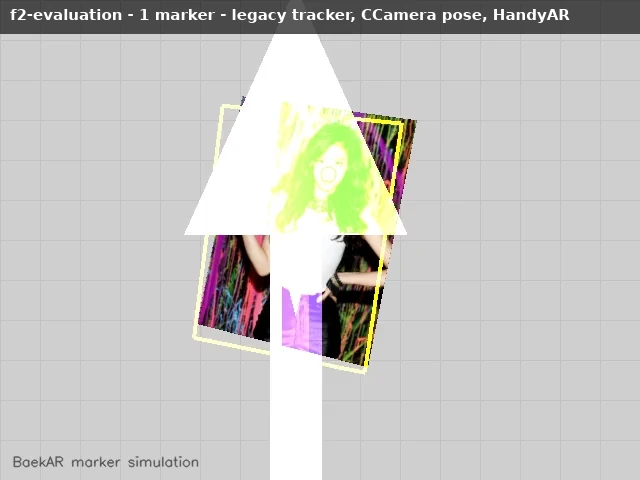
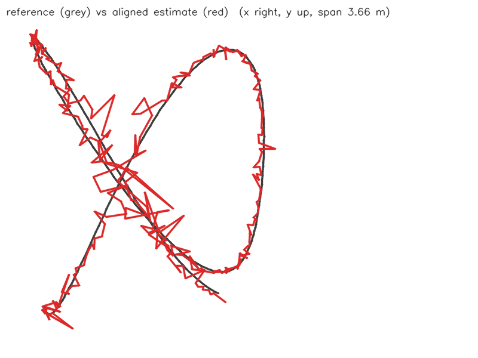
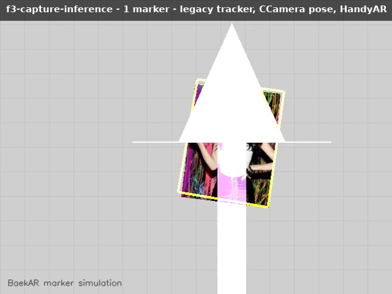

# BaekAR

This was my old project. I made it as my Master's thesis research at Yonsei University in 2012.

BaekAR is a markerless AR engine with natural feature tracking, 6DoF camera pose estimation, 3D rendering, and hand interaction.

My last markerless AR research was 2012.

Now I want to refactor it with modern C++, verify it working well on macOS, and catch up markerless AR trends per year.

This is my original research project. I want to preserve its originality and Git history while continuing it on macOS.

## Current state

The original project was built with Visual Studio 2010, OpenCV 2.3.1, DirectX 9, BRISK, and AGAST.

The macOS version is now merged into `master`. The original 2012 `master` is saved in [`snapshot/2012-original`](https://github.com/ShawnBaek/baekar.github.com/tree/snapshot/2012-original).

Every new PR will merge into `master` without rewriting the original Git history.

## Build on macOS

```bash
brew install cmake opencv@4 glfw glm freeglut assimp

cmake -S . -B build -DCMAKE_BUILD_TYPE=Release
cmake --build build --parallel

open build/BaekAR.app
```

BaekAR needs camera permission on first launch. Run `BaekAR --help` for the camera, marker, replay, recording and tracker options.

Homebrew's `opencv` formula is OpenCV 5, which removed the C API that the 2012 engine still uses. Install `opencv@4`; CMake finds it automatically.

## Build on Linux

Linux builds the same engine for headless verification and CI. macOS-only features (Continuity Camera, camera menu, window capture) are not built there.

```bash
sudo apt-get install cmake libopencv-dev libglfw3-dev freeglut3-dev libglm-dev libassimp-dev

cmake -S . -B build -DCMAKE_BUILD_TYPE=Release
cmake --build build --parallel
ctest --test-dir build
```

To run it with a virtual camera looking at one of the marker images:

```bash
open -n build/BaekAR.app --args --simulate-marker yejin.jpg
```

The virtual camera moves, changes depth and direction, tilts, and rotates. It uses the same marker detection, tracking, pose, and rendering pipeline as the real camera.

To simulate multiple markers:

```bash
open -n build/BaekAR.app --args \
  --simulate-marker yejin.jpg \
  --simulate-marker fish.jpg \
  --simulate-marker cola.jpg
```

Each marker moves independently. BRISK finds them from one shared frame, and batched optical flow tracks them on the same frame timeline. The simulator was verified with ten markers.

Use distinct marker images. Visually similar images are rejected because their identity is ambiguous.

## Plan

The PR-by-PR plan (groundwork, hand tracking, one PR per year) and the license policy are in [`docs/roadmap.md`](docs/roadmap.md).

### Step 1 — Foundation and refactoring

Continue from the merged macOS version. Verify the current behavior first, and then refactor it with smaller PRs.

- Folder structure
- Modern C++ and RAII
- Camera, tracking, pose, hand tracking, and rendering separation
- C++ design patterns where they are useful
- Tests and recorded fixtures
- Native macOS rendering and app packaging

The original 2012 pipeline will stay available for comparison.

Architecture decisions and the folder migration are tracked in [`docs/architecture`](docs/architecture/README.md). The foundation refactoring (stages 1–7) is complete; the 2012 code and its provenance are described in [`legacy/README.md`](legacy/README.md).

### Step 2 — Verify on macOS

Verify real and simulated camera input, marker detection and tracking, 3D object overlay, hand and fingertip tracking, ScreenCaptureKit, permissions, relaunch, and Debug and Release builds.

### Step 3 — Catch up markerless AR trends

Every year will have one focused PR.

#### Shared groundwork (before 2013)

These are built once and reused by every yearly PR.

- **iPhone sensor capture.** Continuity Camera sends only video to the Mac. It does not send depth, LiDAR, IMU, camera intrinsics, or ARKit poses. A small iPhone capture app records these streams into a BaekAR dataset folder. The engine replays that folder through its frame-source port.
- **Reference hardware.** iPhone 17 Pro:
  - 48 MP Fusion (main), Ultra Wide, and Telephoto cameras
  - LiDAR scanner and front TrueDepth camera
  - Accelerometer, gyroscope, magnetometer, and barometer
  - ARKit world tracking, scene depth, and scene reconstruction
- **Learned-model runtime: Core ML.** Models are converted with `coremltools` into one `.mlpackage`. The same package runs on the Mac and on the iPhone. Core ML chooses the Neural Engine, GPU, or CPU. The engine reaches it through a port adapter in `src/platform/macos`. On Linux, the same ports use ONNX Runtime on the CPU, or the feature is off.
- **Common evaluation.**
  - Metrics: trajectory error (ATE and RPE), reprojection error, and frame time.
  - Data: BaekAR's own iPhone recordings and one public dataset (TUM RGB-D or EuRoC).
  - ARKit's pose is recorded as a reference trajectory.

| Year | Focus | Representative work | iPhone sensors used |
|---|---|---|---|
| 2013 | Semi-dense visual odometry | Semi-dense VO (Engel et al.) | Main camera, intrinsics |
| 2014 | Direct SLAM and keyframe maps | LSD-SLAM, SVO | Main camera |
| 2015 | Feature SLAM and relocalization | ORB-SLAM | Main camera |
| 2016 | Stereo and RGB-D SLAM | ORB-SLAM2, DSO | LiDAR depth, TrueDepth; Main + Ultra Wide captured together as a stereo pair |
| 2017 | Visual-inertial tracking and world anchors | VINS-Mono, ARKit/ARCore | Gyroscope and accelerometer, synchronized with frames; ARKit pose as reference |
| 2018 | Learned local features | SuperPoint | Main camera; Core ML on the Neural Engine |
| 2019 | Scene understanding and occlusion | Depth- and segmentation-based occlusion | LiDAR depth, person segmentation |
| 2020 | Learned matching and hand tracking | SuperGlue; learned 3D hand pose (replaces HandyAR's skin model) | Main and TrueDepth cameras; Vision hand pose as a baseline |
| 2021 | Detector-free matching and learned SLAM | LoFTR, DROID-SLAM | Main camera, IMU |
| 2022 | Neural implicit maps | iMAP, NICE-SLAM | LiDAR RGB-D |
| 2023 | 3D Gaussian Splatting | 3DGS; LightGlue for faster matching | RGB with ARKit poses, LiDAR depth for initialization |
| 2024 | Learned dense reconstruction | DUSt3R, MASt3R, Gaussian Splatting SLAM | Main, Ultra Wide, and Telephoto cameras (multi-view) |
| 2025 | 3D visual foundation models | VGGT, MASt3R-SLAM | Main camera; LiDAR depth for evaluation |
| 2026 | Streaming spatial reconstruction | Recurrent/streaming 3D reconstruction (e.g. CUT3R) | Full sensor stream: RGB, LiDAR, IMU |

Changes from the first draft:

- 2021 no longer repeats ORB-SLAM (2016) and visual-inertial tracking (2017). It moves to learned matching and learned SLAM.
- Learned matching (SuperGlue, LoFTR, LightGlue) is added. It is the direct replacement for BaekAR's BRISK + RANSAC matching.
- Learned hand tracking stays in 2020. It can be pulled earlier because HandyAR's skin-color detection is the weakest part today.

Every yearly PR will include:

- Research notes
- One working experiment behind an engine port, not added directly to `EngineMain.cpp`
- Comparison with the previous version on the common evaluation set
- macOS verification

## Progress log

Each milestone of [the roadmap](docs/roadmap.md) records a proof run on Linux (headless Xvfb, synthetic camera) with `scripts/record_proof.sh`. The preview is the first 10 seconds at full resolution; the full MP4 (every scenario, full quality) and the test/run summary are in the milestone folder under [`docs/progress/`](docs/progress/).

### Foundation stages 2–7 (2026-09-29, PR #35)



- Ports-and-adapters layout; `EngineMain.cpp` split into tracker, pose, hand, renderer and scene adapters.
- 1, 3 and 10 simulated markers and a recorded-frame replay: markers found in 1209/1210, 769/773, 333/356 and 952/953 frames. All four runs quit cleanly.
- [Video](docs/progress/foundation/proof.mp4) · [results](docs/progress/foundation/results.txt)

### F1 cleanup: license and GPL removal (2026-09-30)



- Apache-2.0 (`LICENSE`, `NOTICE`, `THIRD_PARTY.md`). The bundled GPL-3.0 BRISK/AGAST and `SungwookFeature.cpp` are out of the build and out of the binary. The three helpers the tracker used were rewritten; they give identical results on all 20 marker images.
- `viewlog.txt` is no longer appended every frame. OpenCV 5 policy: [ADR 0003](docs/architecture/adr/0003-opencv-5.md).
- The multi-marker test now waits for each frame instead of sleeping 12 ms, so it passes on slower machines. 8/8 tests pass.
- Observed: in the real-time 10-marker run on this slower machine, some outlines drift off their markers (for example `yejin.jpg`, `cola.jpg`, `hyojoo.jpg`) while frames are skipped. F1 did not change that tracker; F2 will measure it.
- [Video](docs/progress/f1-cleanup/proof.mp4) · [results](docs/progress/f1-cleanup/results.txt)

### F2 evaluation: datasets, ATE/RPE, benchmark reports (2026-09-30)



- Frames now carry timestamp, depth, intrinsics, IMU and a reference pose. Readers for TUM RGB-D, EuRoC and the BaekAR format ([spec](docs/dataset-format.md)); `--record` writes the BaekAR format and `--replay` detects the layout. The proof's third scenario replays a recorded run: marker found in 690/691 frames.
- `baekar_eval` scores trackers against the synthetic camera, which knows where every marker and the camera are. Camera pose comes from PnP on the tracked corners, and Sim(3) alignment recovers the unknown marker size. With exact corners, the ATE is 5 µm.

  | Run (300 frames) | Found | Corner error, median | Delay | Camera path ATE (RMSE) |
  |---|---|---|---|---|
  | 1 marker, every frame | 100 % | 0.84 px | 29 ms | 0.13 m |
  | 1 marker, real time (30 fps) | 100 % | 2.1 px on screen, 0.84 px on its frame | 1 frame | 0.13 m |
  | 10 markers, every frame | 99.8 % | 4.0 px | 6 ms (p95 173 ms) | 1.32 m |
  | 10 markers, real time | 100 % | 6.2 px on screen, 4.0 px on its frame | 2.5 frames (max 12) | 0.33 m |

  

- Findings:
  - One-marker poses jitter where planar PnP flips between two poses at near-frontal views.
  - Multi-marker outlines drift when frames are skipped. The ten-marker detector processes about one frame in three on this 4-core container, and its found rate in real time swung from 0.5 % to 100 % between runs with machine load. That is why the tests check real-time runs only for consistency.
  - The ten-marker camera path is poor because marker 0 is only about 100 px tall. The multi-marker tracker draws outlines only and does not drive the pose.
- TUM RGB-D / EuRoC runs are pending: this environment's network policy blocks their hosts. The readers are tested on generated fixtures in both layouts.
- 11/11 tests pass (GCC and Clang). [Video](docs/progress/f2-evaluation/proof.mp4) · [results](docs/progress/f2-evaluation/results.txt) · [reports](docs/progress/f2-evaluation/reports/)

### F3 capture and inference: iPhone app, Core ML / ONNX port (2026-10-01)



- **Inference port** (`IInferenceEngine`): Core ML on macOS/iOS and ONNX through OpenCV DNN everywhere else, with no new dependency. `baekar_eval model M` prints a model's inputs and outputs and times it.
  - On macOS CI, the Core ML and ONNX versions of the test model both give the expected outputs. On Linux, a Core ML model fails with a clear message.
  - Learned trackers (H, Y2018+) will plug in here.
- **iPhone capture app** (`ios/`): records ARKit colour (JPEG), LiDAR depth (16-bit PNG, mm), intrinsics, the ARKit camera pose (converted to OpenCV axes) and 200 Hz IMU into the BaekAR dataset format. Recordings show up in the Files app; copy a folder to a Mac and run `BaekAR --replay <folder>`.
- **What CI checks:**
  - The Swift dataset library builds and passes its tests on Linux and macOS.
  - The C++ engine reads the dataset those tests write ("5 frames, 5 with depth, 4 with pose, 50 IMU samples").
  - The app compiles for iOS devices without code signing.
- **Not yet done:** a recording on a real iPhone, which needs the owner's device. The proof video shows the engine scenarios, since the app cannot run here.
- 12/12 C++ tests, 10/10 Swift tests. [Video](docs/progress/f3-capture-inference/proof.mp4) · [results](docs/progress/f3-capture-inference/results.txt)

## Master's thesis

[Master Thesis — Sungwook Baek — BaekAR](Master_Thesis_Yonsei_University_Computer_Science_Sungwook_Baek_BaekAR.pdf)

## License

BaekAR is licensed under [Apache-2.0](LICENSE). Third-party code, data and models keep their own licenses; they are listed in [THIRD_PARTY.md](THIRD_PARTY.md). Only permissive dependencies go into what BaekAR builds (see the license policy in [docs/roadmap.md](docs/roadmap.md#license-policy)).
