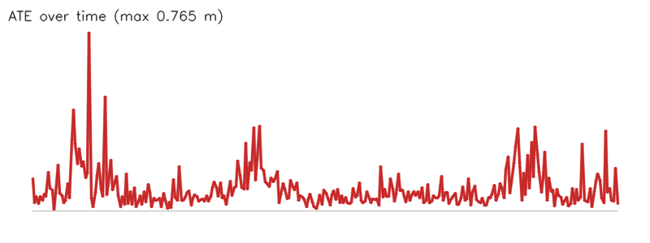

# Camera path from yejin.jpg (1-marker benchmark (every frame))

- Matched poses: 300
- Alignment: Sim(3), scale 1.6967
- ATE: RMSE 0.126 m, mean 0.094, median 0.066, p95 0.251, max 0.765 (n=300)
- RPE translation: RMSE 0.160 m, mean 0.119, median 0.081, p95 0.326, max 0.843 (n=299)
- RPE rotation: RMSE 1.657 deg, mean 1.272, median 0.940, p95 3.468, max 7.803 (n=299)

