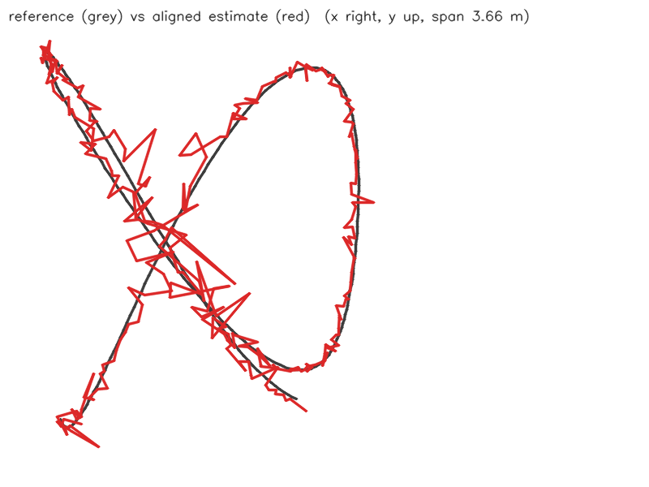
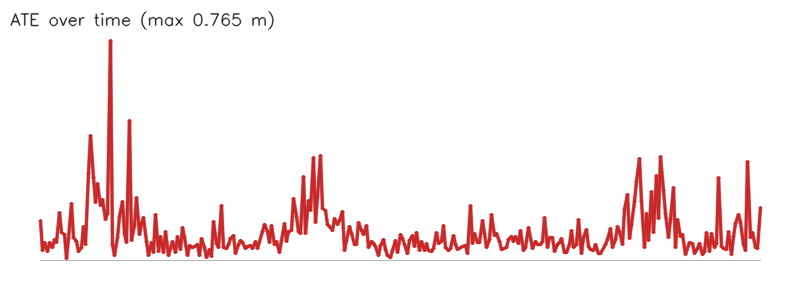

# Camera path from yejin.jpg (1-marker benchmark (real time))

- Matched poses: 293
- Alignment: Sim(3), scale 1.6963
- ATE: RMSE 0.127 m, mean 0.095, median 0.067, p95 0.267, max 0.765 (n=293)
- RPE translation: RMSE 0.161 m, mean 0.120, median 0.082, p95 0.326, max 0.842 (n=292)
- RPE rotation: RMSE 1.670 deg, mean 1.282, median 0.955, p95 3.468, max 7.803 (n=292)

