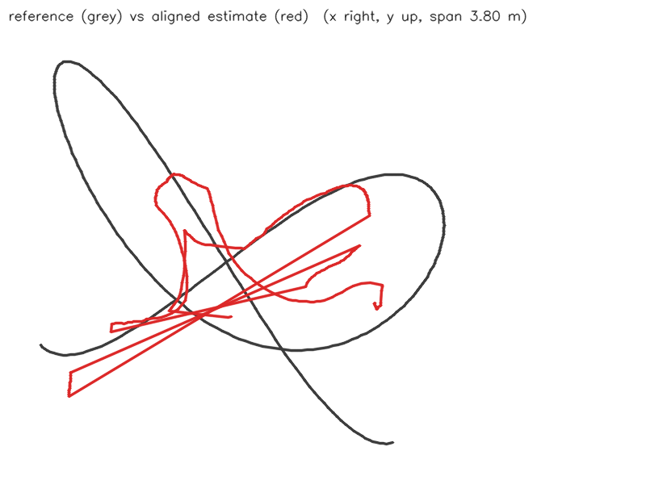
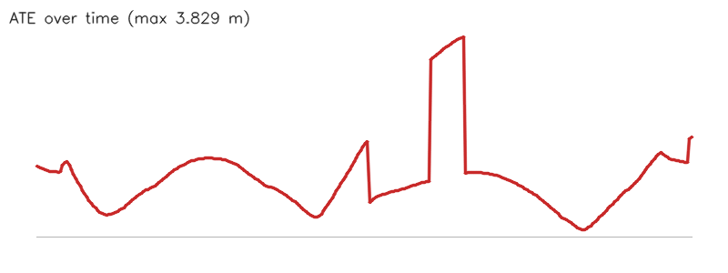

# Camera path from yejin.jpg (10-marker benchmark (every frame))

- Matched poses: 300
- Alignment: Sim(3), scale 0.4727
- ATE: RMSE 1.322 m, mean 1.117, median 1.020, p95 3.384, max 3.829 (n=300)
- RPE translation: RMSE 0.294 m, mean 0.075, median 0.041, p95 0.105, max 3.399 (n=299)
- RPE rotation: RMSE 6.677 deg, mean 1.200, median 0.354, p95 1.652, max 79.329 (n=299)

