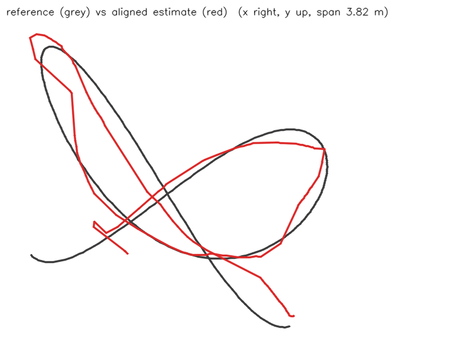
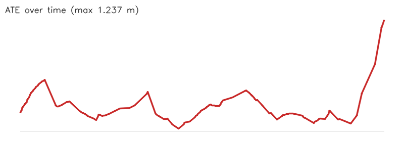

# Camera path from yejin.jpg (10-marker benchmark (real time))

- Matched poses: 153
- Alignment: Sim(3), scale 1.0263
- ATE: RMSE 0.325 m, mean 0.271, median 0.221, p95 0.543, max 1.237 (n=153)
- RPE translation: RMSE 0.100 m, mean 0.047, median 0.020, p95 0.220, max 0.658 (n=152)
- RPE rotation: RMSE 0.942 deg, mean 0.469, median 0.212, p95 2.255, max 5.987 (n=152)

