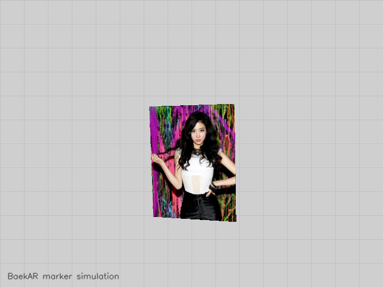
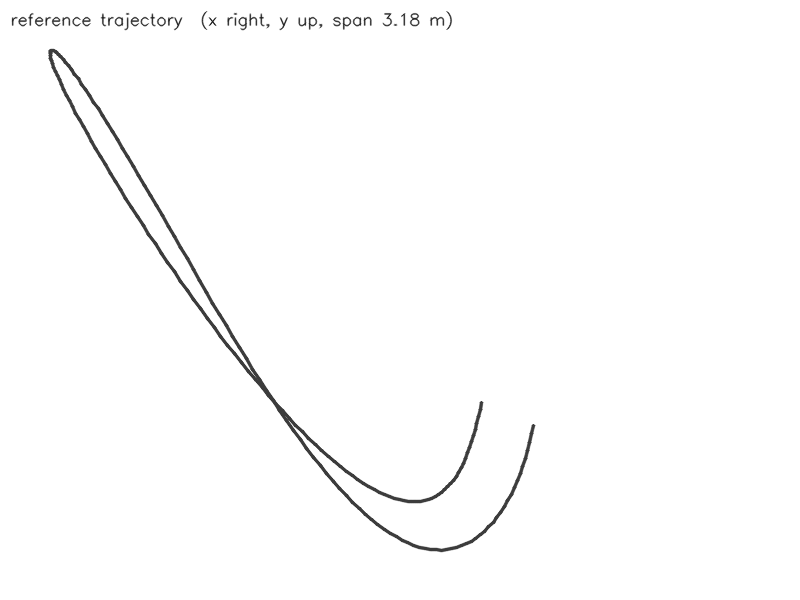

# Dataset: BaekAR dataset /tmp/claude-0/rec (synthetic camera (1 marker(s)))

- Frames: 201 over 6.66667 s (30 fps)
- With depth: 0
- With reference pose: 201
- IMU samples: 0
- Intrinsics: fx 576, fy 576, cx 320, cy 240, 640x480

